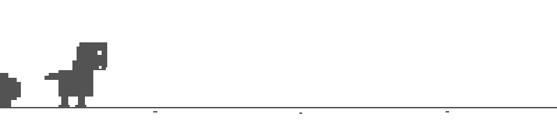

  
  

I build **Next.js platforms for Swiss SMBs and founders** — e-commerce, internal tools, AI-augmented apps. Currently shipping [**mrbrunch.ch**](https://mrbrunch.ch), an enterprise-grade brunch delivery platform.

**📍** Schaffhausen, Switzerland &nbsp;·&nbsp; **🌐** [briangantner.ch](https://briangantner.ch) &nbsp;·&nbsp; **📬** open to freelance, contract, consulting

---

  

### 🚀 Currently shipping

| Project | What it is |
|---|---|
| [**mrbrunch.ch**](https://mrbrunch.ch) | Swiss brunch e-commerce. B2B accounts, subscription orders, Stripe + Bexio billing, inventory-driven catalog. Next.js 16 · Prisma · TypeScript · Vercel. |
| [**animalpoliceassociation.com**](https://animalpoliceassociation.com) | Public-facing site for the Animal Police Association. Bilingual, accessible, content-driven. |
| [**AdventCraft**](https://github.com/adventcraft/adventcraft) ([adventcraft.app](https://adventcraft.app)) | Cross-platform mobile app — interactive advent calendars for creators and brands. iOS + Android via Compose Multiplatform, Ktor backend, embed via iFrame or export as Reels/Shorts. |
| [**briangantner.ch**](https://briangantner.ch) | Portfolio + contact hub. |
| **50+ live platforms** | Physiotherapy, optometry, jewelry, photography, gardening, hairdressing, sewing studios, restaurants, consulting firms. Bilingual (DE/EN), animated, performance-tuned. |
| **AI-augmented features** | Claude API, Vercel AI SDK, agentic workflows, MCP integrations on top of production apps. |

### 🧱 Tech stack

<table>
  <tr>
    <td valign="top" width="50%">
      <h4 align="center">Frontend</h4>
      

    </td>
    <td valign="top" width="50%">
      <h4 align="center">Backend & Data</h4>
      

    </td>
  </tr>
  <tr>
    <td valign="top" width="50%">
      <h4 align="center">DevOps & Tooling</h4>
      

    </td>
    <td valign="top" width="50%">
      <h4 align="center">CMS, Commerce & Marketing</h4>
      

        
        
        
        
        
        
      

    </td>
  </tr>
</table>

### 🛠 How I work

- **Clean Architecture** with ESLint-enforced boundaries — domain layer has zero external deps
- **Type-safe end-to-end** — Zod-validated APIs, Prisma typed queries, no `any`
- **Production-first** — observability, audit logging, sensitive-data masking, CSRF, rate limiting
- **Swiss quality, fast delivery** — ships under tight timelines without skipping the basics

### 📊 By the numbers

  
  
  

Most of my GitHub repos are private client work — code samples and case studies on request via <a href="https://briangantner.ch">briangantner.ch</a>.

### 📬 Reach me

  
  
  

